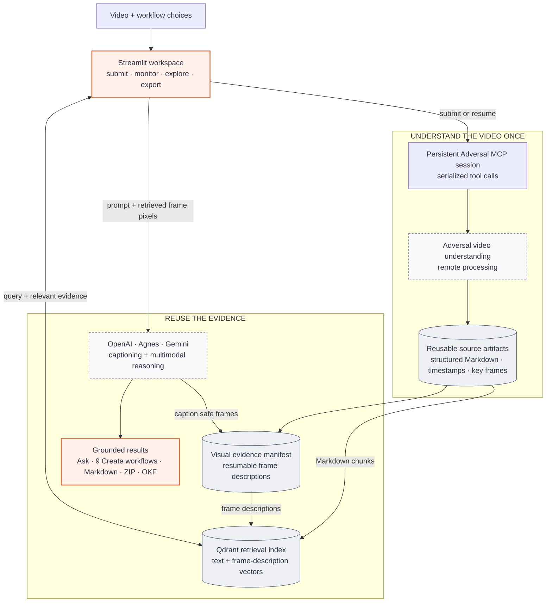

<div align="center">

# Video Summarizer

Process one video into structured notes, visual frames, answers with sources, and content
you can reuse for learning or publishing.

[](https://github.com/pypi-ahmad/video-summarizer/actions/workflows/ci.yml)
[](https://www.python.org/)
[](https://streamlit.io/)
[](https://docs.astral.sh/uv/)
[](./LICENSE)

[Get started](#getting-started) · [Workflows](#what-you-can-create) ·
[Adversal guide](#powered-by-adversal-ai) · [Architecture](#architecture) ·
[Documentation](#documentation)

</div>

Video Summarizer is a Streamlit workspace for one user, built around
[Adversal](https://adversal.ai). Upload a video or provide a public URL once. Adversal
returns chaptered Markdown and selected screenshots. The app reuses those files for
semantic search, study material, operating documents, and publishable content without
running another analysis on the video.

> [!IMPORTANT]
> Adversal is a remote video-understanding service exposed through a local
> `adversal-cli` MCP subprocess. Video analysis happens on Adversal's infrastructure;
> this application stores the returned Markdown, frames, and request metadata locally.

## Powered by Adversal AI

> [!TIP]
> **[Adversal AI](https://adversal.ai/) turns long videos into clean Markdown and
> useful visual frames for AI agents.** Give it a local video or public URL, let the
> remote job run asynchronously, then reuse the result without placing the entire raw
> video in every model prompt. Adversal currently offers **100 free processing minutes
> each month**. [Explore Adversal](https://adversal.ai/) ·
> [Read the MCP guide](https://adversal.ai/documentation/mcp) ·
> [See pricing](https://adversal.ai/pricing)

Adversal is the video-understanding engine behind this application. It handles the
multimodal source pass—speech, scenes, slides, diagrams, code, and other important
visual context—and writes the result to a folder as structured notes plus selected
images. Video Summarizer then adds a visual workspace, Qdrant retrieval, grounded Q&A,
task-specific documents, and portable downloads around those artifacts.

This repository is an **independent integration**. It is not an official Adversal
product and does not imply a partnership or endorsement. Adversal owns its service,
accounts, published pricing, quotas, benchmark claims, and MCP CLI.

### What Adversal provides

| Capability | What it gives you |
| --- | --- |
| **Local files and public URLs** | Process an authorized video from disk or a URL supported by the remote downloader |
| **Structured Markdown** | Readable sections, summaries, timestamps, and notes instead of one unbounded transcript |
| **Key visual frames** | Selected screenshots that preserve useful slides, diagrams, code, and scenes |
| **Purpose-aware analysis** | `generic`, `lesson`, `interview`, and `meeting` modes shape the notes for the source |
| **Adjustable image selection** | `minimal`, `selective`, or `generous` controls how many representative images are extracted |
| **Clip and exact-frame controls** | Analyze a time range and optionally request frames at specific timestamps |
| **Asynchronous jobs** | Submit once, retain the request ID, and check status without holding one long client connection open |
| **Agent-ready interface** | Use the local MCP server from Claude Code, OpenCode, Cursor, or another stdio MCP client |
| **Browser-based sign-in** | Authenticate through OAuth; no Adversal API key is placed in an MCP configuration file |
| **Quota visibility** | Ask the MCP server for remaining monthly minutes and account-tier information |

Adversal's MCP server exposes four tools:

| Tool | Purpose |
| --- | --- |
| `authenticate` | Starts or refreshes the browser OAuth session |
| `process_video` | Submits a local file or public URL and returns a `request_id` |
| `check_video_status` | Reports `RUNNING`, `COMPLETED`, `FAILED`, or `UNKNOWN` for that request |
| `check_remaining_quota` | Reports the remaining monthly allowance and tier details |

`process_video` requires exactly one of `video_path` or `video_url`, plus an
`output_path`. It also accepts `file_name` (default `notes.md`), `type`, `images`,
`start_time`, `end_time`, and a `timestamps` list. Time values can be seconds, `MM:SS`,
or `HH:MM:SS`. Explicit timestamp frames are written below
`<output_path>/requested_frames`.

### Install and connect Adversal directly

You can use Adversal without this Streamlit application. Its published prerequisites
are Python 3.13 or newer and FFmpeg/FFprobe. Install FFmpeg for your platform, then
install the MCP server:

```powershell
# Windows
winget install ffmpeg
python -m pip install adversal-cli
```

```bash
# macOS
brew install ffmpeg
python -m pip install adversal-cli

# Debian or Ubuntu
sudo apt install ffmpeg
python -m pip install adversal-cli
```

`yt-dlp` is installed with `adversal-cli`. Add the server to a supported MCP client:

```bash
# Claude Code
claude mcp add adversal -- adversal-cli
```

For OpenCode, add this to its configuration:

```json
{
  "mcp": {
    "adversal": {
      "type": "local",
      "command": ["adversal-cli"],
      "enabled": true,
      "timeout": 400000
    }
  }
}
```

For Cursor, add this MCP server:

```json
{
  "mcpServers": {
    "adversal": {
      "command": "adversal-cli",
      "args": []
    }
  }
}
```

Restart the client after changing its configuration. Ask the agent to process a video.
If the tool reports `AUTHENTICATION REQUIRED`, call `authenticate`, complete the
browser flow, and retry the original request without restarting the MCP server. The
refresh session is stored at `~/.adversal/auth.txt`.

A typical direct workflow is:

1. Ask `check_remaining_quota` how many minutes are available.
2. Call `process_video` with one authorized local path or public URL, an output folder,
   the most suitable analysis type, and the desired image density.
3. Save the returned `request_id`; do not submit the same video again while it runs.
4. Poll `check_video_status` until it reaches `COMPLETED` or `FAILED`. Request state
   survives MCP subprocess restarts.
5. Open the generated Markdown and images, or give that bounded evidence to another
   agent for searching, summarizing, or transformation.

### Use Adversal through this app

Video Summarizer manages that MCP lifecycle for you:

1. Run this project and open the Streamlit page.
2. Upload an authorized video or paste a supported public URL.
3. Choose the analysis profile and visual-frame density.
4. Optionally expand **Advanced processing controls** to select a clip or exact frames.
5. Select **Process video** and complete Adversal authentication if prompted.
6. Watch the saved request while the app polls every eight seconds.
7. Inspect the source Markdown and frames, ask grounded questions, create reusable
   documents, or download native and OKF bundles.

The first five steps use Adversal. Search, Qdrant indexing, LLM-generated workflows,
OKF export, ZIP packaging, persistence UI, and downloads are features added by this
repository.

### Why use structured video understanding

- **Smaller downstream prompts:** agents can work from relevant chapters instead of
  repeatedly consuming an entire transcript or video.
- **Visual context survives:** screenshots keep information that speech-only
  transcription misses.
- **One analysis, many outputs:** the same evidence can support notes, search, meeting
  actions, SOPs, quizzes, FAQs, blog posts, and other workflows.
- **Long jobs are resumable:** request IDs and status checks fit agent workflows better
  than a single connection that must remain open for the whole analysis.
- **Model-independent artifacts:** Markdown and images are inspectable, portable, and
  usable by different agents and language models.
- **Low-friction trial:** the free Researcher tier needs no payment card and currently
  includes 100 minutes per month.

Common uses include lecture and course notes, meeting or webinar summaries, interview
analysis, searchable video libraries, content triage, help-center material, SOPs with
screenshots, and repurposing recorded material into publishable content.

### Published pricing and benchmark results

Adversal publishes these monthly plans as of **August 23, 2026**:

| Plan | Published price | Included processing |
| --- | ---: | ---: |
| Researcher | Free, no card required | 100 minutes/month |
| Lite | $10/month | 1,000 minutes/month |
| Pro | $20/month | 2,500 minutes/month |
| Ultra | $50/month | 6,000 minutes/month |
| Enterprise | Custom | Custom |

Its pricing page also publishes an effective comparison of **$0.008/minute** for
Adversal, versus $0.031 for Gemini 3.1 Pro Preview, $0.040 for GPT-5.6 Sol, and $0.042
for Claude Opus 5—described by Adversal as up to **5.3× lower cost**. These are vendor
figures, not an independent cost study; workloads and comparison assumptions can
change the real result.

Adversal also publishes these [LongShOTBench](https://longshot.cvmbzuai.com/leaderboard)
results: Gemma 3 27B at 41.5%, Gemini 3.1 Pro at 55.6%, and Gemma 3 27B with Adversal at
72.1%. Treat them as vendor-reported benchmark results and review the benchmark method
before using them for a purchasing decision.

Pricing, quotas, supported clients, model comparisons, and benchmark results can
change. Check [Adversal's current pricing](https://adversal.ai/pricing) and
[official MCP documentation](https://adversal.ai/documentation/mcp) before deployment.
Only process videos you are authorized to send to a remote service; review Adversal's
current privacy and service terms for your data-handling requirements.

## Why this project exists

Long videos are difficult inputs for language models. Full transcripts consume large
context windows, while transcript-only pipelines miss slides, diagrams, code, and other
useful scenes. This project keeps the expensive video pass separate from later reuse:

1. Adversal extracts structured chapters and representative visual frames.
2. The app keeps those artifacts as the source you can inspect.
3. An explicit visual-index step describes the safe frames with the selected model.
4. Qdrant retrieves relevant chapters and frame descriptions for each task.
5. The selected model receives both that context and the retrieved frame pixels.

This gives each video one durable workspace instead of a separate pipeline for every
output.

## What you can create

| Workflow | Output |
| --- | --- |
| **Study notes** | Original chaptered Markdown with timestamps and referenced screenshots |
| **Meeting/webinar summary** | Two compact bullet sections: Decisions and Action Items, including owners when identified |
| **Searchable knowledge base** | Grounded answers from five text chunks and up to three relevant frames, with citations and visible sources |
| **Content triage** | Three to five summary bullets plus a watch-in-full, skim, or skip recommendation with a reason |
| **Blog post** | Title, opening hook, preserved chapter body and screenshots, and conclusion |
| **Quiz and flashcards** | Six multiple-choice questions, four short-answer questions, an explained answer key, and fifteen flashcards |
| **SOP/how-to guide** | Purpose, prerequisites, numbered procedure, cautions, verification, troubleshooting, and supported screenshots |
| **Interview insight pack** | Executive summary, themes, Q&A insights, paraphrased statements, and follow-up questions |
| **FAQ/help-center article** | Title, overview, organized FAQs, supported troubleshooting, related topics, and useful screenshots |

## Feature guide

### Video input and source analysis

The submission form accepts one source at a time:

| Feature | Behavior |
| --- | --- |
| **Local upload** | Accepts `.mp4`, `.mov`, `.mkv`, and `.webm`; stores the file inside a unique UUID-bearing job directory |
| **Public URL** | Passes the URL to Adversal's remote downloader; the app does not download it itself |
| **Analysis profile** | Generic, Lesson/tutorial, Interview, or Meeting/webinar changes how Adversal structures the source analysis |
| **Visual-frame density** | Minimal, Selective, or Generous controls how many representative frames Adversal returns |
| **Focused time range** | Optional start and end values accept seconds, `MM:SS`, or `HH:MM:SS` |
| **Exact frames** | Optional comma- or line-separated timestamps request specific local screenshots |
| **Process-once model** | The selected profile, density, and focused controls apply once; all later views reuse the completed Markdown and images |
| **Non-blocking progress** | A Streamlit fragment polls Adversal every eight seconds while the rest of the application remains responsive |

Uploaded filenames are reduced to a safe basename and verified to remain inside their
job directory. URL access, authentication, and download duration still depend on the
source host and Adversal.

### Notes and visual evidence

The completed Adversal result appears directly before any LLM summary:

- **Notes** renders the original chaptered Markdown and its local image references.
- **Metrics** show section count, safe referenced-frame count, and analysis profile.
- **Key frames** presents screenshots in a three-column gallery, twelve per page, with
  captions taken from Markdown alt text or filenames, plus safely contained exact frames
  requested during submission.
- **Path containment** rejects Markdown images outside the owning job directory before
  they can be displayed or archived.
- **Missing-artifact handling** reports when Adversal marked a job complete but
  `notes.md` is absent, or when no safe referenced frames were returned.

### Searchable video knowledge base

The **Ask** view turns completed notes and frames into persistent multimodal video RAG:

1. Notes are split along Adversal chapter separators and headings into chunks targeting
   at most 1,500 characters.
2. **Build visual index** explicitly asks the selected backend to describe every safe
   Adversal key/requested frame. Each successful description is saved immediately in
   `visual-evidence.json`, so interrupted work can resume.
3. OpenAI `text-embedding-3-small` embeds text chunks and frame descriptions into the
   same collection; Qdrant labels each point as `text` or `frame`.
4. Each question retrieves five text chunks and up to three frames for the current video.
5. The selected model receives the retrieved text, descriptions, and actual frame pixels.

Answers include an expandable **Sources** list with text citations and retrieved frame
thumbnails, captions, timestamps, and scores. Text-only Ask remains available if no
visual index exists or the selected provider rejects image input.
Turn off **Use visual evidence in Ask and Create** at any time to keep the persisted
captions while running the current task from text only.

> [!NOTE]
> Ask always requires `OPENAI_API_KEY` for embeddings. Agnes or Gemini may answer the
> final question, but they do not replace the fixed OpenAI embedding model.

### Generated documents

The **Create** view offers seven grounded transformations listed in
[What you can create](#what-you-can-create). Every generated document:

- uses the completed Adversal notes and up to four retrieved frame pixels when a visual
  index is available;
- exposes the source notes in an expander for verification;
- renders supported local screenshots where the workflow preserves image references;
- downloads as a workflow-specific Markdown file; and
- starts only after an explicit **Generate** click; and
- is cached by `(request_id, selected_backend, visual_evidence_hash)` so reruns do not
  repeat paid calls or reuse stale visual context.

Notes up to 50,000 characters are sent to final generation directly. Longer notes are
condensed in batches of at most 30,000 characters until they fit. Blog, SOP, and FAQ
workflows explicitly preserve supported Markdown image references during reduction.
Changing the backend creates a separate cached version without processing the video
again.

### Downloads and agent-ready exports

The **Notes** view provides three source-artifact formats:

| Download | Contents | Best for |
| --- | --- | --- |
| **Markdown** | Adversal's completed `notes.md` | Reading, editing, or passing text to another tool |
| **Native bundle** | Source Markdown plus only its safely resolved referenced images | Moving the original Adversal result as one ZIP |
| **OKF 0.2 bundle** | `index.md`, `video.md`, chapter concepts, and image assets | Ingestion by agents or knowledge-catalog workflows |
| **Download all** | The three source downloads plus Create documents already cached for the active video and backend | Collecting available outputs without new LLM calls |

Every filename starts with a safe form of the original video stem, such as
`My_Lecture_notes.md`, `My_Lecture_blog_post.md`, or
`My_Lecture_all_downloads.zip`. Generated Create outputs retain their own **Download as
Markdown** action. Download all does not generate missing documents; it includes only
the versions already cached for the selected backend. Exports exclude the uploaded
video, Qdrant data, job history, and unreferenced files.

### Provider selection

The **LLM backend** sidebar control switches chat and document generation without code
changes:

- OpenAI `gpt-5.6-luna` with medium reasoning effort;
- Agnes AI `agnes-2.5-flash`;
- Google `gemini-3.5-flash-lite` with medium thinking; or
- Google `gemini-3.7-flash` with medium thinking.

Provider credentials come from environment variables or an optional gitignored
`.env`. Existing environment values win. There is no automatic provider fallback, so a
missing key or provider failure stays visible. The app does not silently change models.

### Authentication and quota

Adversal uses browser OAuth, not an application API key. When an Adversal tool returns
`AUTHENTICATION REQUIRED`, the app pauses and shows an
**Authenticate** action:

- locally, the browser flow opens on the computer running Streamlit;
- in a private Hugging Face Space, the app instructs the user to open the temporary URL
  printed in runtime logs; and
- the persisted Adversal directory lets later application processes reuse the authenticated
  session.

The banner clears only after Adversal returns `AUTHENTICATED`. An expired browser flow
or `AUTHENTICATION FAILED` response remains visible as an error instead of being treated
as a successful login.

The sidebar **Quota** panel calls Adversal's `check_remaining_quota` tool and displays
the current response without starting video processing.

### Resumable jobs and workspace controls

Each successful submission is stored in `runs/jobs.json` with its request ID, status,
source, profile, density, optional time range and frame timestamps, and output directory.
Writes use a process-local lock and atomic replacement.

- **Resume a previous job** lists the ten newest records with source, status, and request
  prefix.
- **Retry status check** turns a failed or unknown saved job back into `RUNNING` and
  polls its existing Adversal request ID; it never uploads or submits the video again.
- **Process another video** leaves a completed workspace without deleting it.
- **Start over** leaves a failed workspace while retaining its persisted record.
- **Danger zone → Clear all runs** closes the embedded Qdrant client and permanently
  deletes uploads, jobs, notes, frames, and vectors after explicit confirmation.

Generated documents and Ask chat history stay in the session instead of being persisted.
Source artifacts, jobs, and vectors are durable.

### Logging and diagnostics

Application progress appears in the `launch.cmd` terminal and in
`logs/video-summarizer.log`. Logging is safe across Streamlit reruns, rotates at 5 MiB,
and retains three backups. `VIDEO_SUMMARIZER_LOG_LEVEL` selects `DEBUG`, `INFO`,
`WARNING`, `ERROR`, or `CRITICAL`.

Events contain operational metadata such as components, request IDs, models, counts,
durations, statuses, and error types. The application deliberately omits filenames,
URLs, prompts, transcripts, generated content, and exception messages; configured keys
and common token formats are redacted.

### Local and private hosted operation

- **Windows launcher:** installs uv when needed, pins Python 3.13.13, creates `.venv`,
  performs a locked sync, creates `.env` when missing, checks FFmpeg, and starts the app.
- **Manual uv workflow:** supports developers who manage the environment directly.
- **Docker image:** packages Python, uv, FFmpeg, the app, and `adversal-cli` for port
  7860.
- **Persistent Space storage:** maps `/data/runs`, `/data/adversal`, and `/data/logs` so
  application data and OAuth state survive container restarts.
- **Private single-user boundary:** public/shared hosting is intentionally unsupported
  because users would share identity, files, vectors, history, and deletion controls.

## Architecture



[Open the interactive architecture diagram](./docs/diagrams/video-summarizer-architecture.html) or view the [Mermaid source](./docs/diagrams/system-architecture.mmd).

The Streamlit process lazily opens one `adversal-cli` MCP subprocess. A daemon worker
thread owns its asynchronous MCP context, while a thread-safe queue serializes
submission, status, quota, and authentication calls onto that session. This keeps
Adversal's background extraction task alive across Streamlit reruns. Transport failures
discard the broken session so the next action can create a fresh one; they do not
automatically resubmit a video. After a real application restart, Adversal's local
registry recovers earlier request IDs. Completed artifacts feed four workspace views:

| View | Responsibility |
| --- | --- |
| **Notes** | Inspect source Markdown and download Markdown, native, or OKF bundles |
| **Key frames** | Browse safe, locally referenced and explicitly requested images |
| **Ask** | Index, retrieve, answer, and expose supporting chapters |
| **Create** | Generate one of seven cached Markdown documents |

More diagrams: [processing sequence](./docs/diagrams/video-processing-sequence.svg) ·
[job lifecycle](./docs/diagrams/job-lifecycle.svg) ·
[private Space deployment](./docs/diagrams/private-space-deployment.html)

## Getting started

### Prerequisites

- Windows 11 for the one-command launcher, or any environment capable of running the
  manual uv workflow
- `ffmpeg` and `ffprobe` on `PATH`
- An [Adversal](https://adversal.ai) account
- A provider key only for the LLM-backed features you plan to use

Notes, frames, and artifact downloads do not require an LLM key. **Ask always requires
`OPENAI_API_KEY`** because embeddings use OpenAI regardless of the selected chat model.

### Windows quick start

From the repository root:

```bat
launch.cmd
```

On its first run, the launcher:

1. installs uv for the current Windows user when missing;
2. installs Python 3.13.13;
3. creates `.venv` in the project root;
4. synchronizes the locked production and development dependencies;
5. creates `.env` from `.env.example` when needed; and
6. starts Streamlit with live logs in the same terminal.

Open the URL printed by Streamlit, normally <http://localhost:8501>. The first Adversal
operation may request browser authentication.

### Manual uv setup

```bash
uv python pin 3.13.13
uv sync --locked --all-groups
cp .env.example .env   # optional when keys already exist in the environment
uv run streamlit run app.py
```

On PowerShell, replace the copy command with:

```powershell
Copy-Item .env.example .env
```

## Configuration

The app reads credentials from the process environment. A local `.env` is an optional
fallback and never overrides existing environment variables.

| Variable | Used for | Required? |
| --- | --- | --- |
| `OPENAI_API_KEY` | OpenAI chat and all Ask embeddings | For OpenAI or Ask |
| `OPENAI_BASE_URL` | Optional OpenAI-compatible gateway | No |
| `AGNES_API_KEY` | Agnes AI chat | For Agnes |
| `GOOGLE_API_KEY` | Gemini chat | For Gemini |
| `VIDEO_SUMMARIZER_LOG_LEVEL` | `DEBUG`, `INFO`, `WARNING`, `ERROR`, or `CRITICAL` | No; defaults to `INFO` |
| `VIDEO_SUMMARIZER_DATA_DIR` | Persistent container-data root | No; container defaults to `/data` |

Configured model choices:

| Provider | Model | Reasoning setting |
| --- | --- | --- |
| OpenAI | `gpt-5.6-luna` | medium reasoning effort |
| Agnes AI | `agnes-2.5-flash` | provider default |
| Google | `gemini-3.5-flash-lite` | medium thinking |
| Google | `gemini-3.7-flash` | medium thinking |

> [!CAUTION]
> Never commit `.env`, paste secret values into issues, or store provider keys as
> non-secret Hugging Face variables.

## Using the app

1. Select **Upload file** or **Public URL**.
2. Choose the video type: Generic, Lesson/tutorial, Interview, or Meeting/webinar.
3. Choose Minimal, Selective, or Generous key-frame extraction.
4. Optionally set a clip range or exact frame timestamps under advanced controls.
5. Select **Process video** and let the status panel poll Adversal.
6. Review **Notes** and **Key frames** before relying on generated material.
7. Use **Ask** for grounded questions or **Create** for a reusable document.

The sidebar can check Adversal quota, resume one of the ten newest persisted jobs, switch
the generation backend, or permanently clear all run data.

> [!TIP]
> If Adversal cannot download a long or protected URL, upload an authorized local file.
> Remote URL ingestion is limited by the source host and Adversal's download timeout.

## Data and persistence

```text
runs/
├── jobs.json
├── qdrant/
└── <timestamp>_<uuid>_<video-slug>/
    ├── <uploaded-video>
    ├── notes.md
    └── <referenced frames>
```

Generated documents and Ask chat history live in Streamlit session state. Jobs, source
artifacts, and vectors persist on disk. Run data is not encrypted and has no automatic
retention period; use **Danger zone → Clear all runs** when it is no longer needed.

## Private Hugging Face deployment

The repository includes a Docker image and entrypoint for a **private, single-user**
Hugging Face Space. A private bucket is mounted at `/data` so these survive restarts:

- `/data/runs`: uploaded videos, jobs, Markdown, frames, and Qdrant data;
- `/data/adversal`: Adversal OAuth state and local request registry; and
- `/data/logs`: rotating application logs.

Creating a Docker Space requires a paid Hugging Face plan. See the
[deployment procedure](./docs/HOW_TO.md#deploy-to-hugging-face-spaces) for the checked-in
target configuration.

> [!WARNING]
> Do not deploy this application publicly or for several users. Visitors would share one
> Adversal identity, job history, Qdrant index, uploaded data, and destructive controls.

## Technology stack

| Area | Technology |
| --- | --- |
| UI and session orchestration | Streamlit |
| Runtime and dependency management | Python 3.13.13 and uv |
| Video understanding | Adversal through MCP stdio |
| Retrieval | Qdrant Client with OpenAI embeddings |
| Text generation | OpenAI, Agnes AI, and Google Gemini |
| Media inspection | FFmpeg and ffprobe |
| Quality | Ruff, ty, pytest, and GitHub Actions |
| Hosted packaging | Docker and Hugging Face Spaces |

## Project structure

```text
video-summarizer/
├── app.py                    # Streamlit entry point and workspace routing
├── pipeline.py               # Job persistence, polling, and artifact rendering
├── adversal_client.py        # MCP adapter for adversal-cli
├── artifacts.py              # Safe frame discovery and ZIP/OKF exports
├── modes.py                  # Search and seven generated-document workflows
├── visual_evidence.py        # Safe, resumable frame-caption manifest
├── vector_store.py           # Persistent text/frame Qdrant retrieval
├── llm.py                    # Multimodal provider dispatch and OpenAI embeddings
├── observability.py          # Terminal/file logging and secret redaction
├── launch.cmd                # Canonical Windows bootstrap and launcher
├── Dockerfile                # Private Hugging Face runtime image
├── container-entrypoint.sh   # Persistent /data path mapping
├── tests/                    # Regression and observability tests
└── docs/                     # User, operator, architecture, and codebase guides
```

## Development

Install the locked environment and run the same quality gates used by CI:

```bash
uv sync --locked --all-groups
uv run ruff check .
uv run ty check
uv run pytest -q
```

The current suite covers Adversal response contracts and connection reuse, focused-job
compatibility, filesystem containment, export safety, provider contracts, cache behavior,
long-note reduction, Qdrant filtering and idempotency, concurrent job persistence, and
logging redaction/rotation. It currently contains 34 focused tests. External Adversal and
model services are not called during tests.

For module ownership and safe change paths, read the
[developer/operator technical guide](./docs/TECHNICAL_GUIDE.md).

## Current limitations

- One video workspace is active per browser session.
- Generated documents and chat history stay in the session and are not persisted.
- Embedded Qdrant and `jobs.json` locking support one server process only.
- Public video URLs do not have an application-level host or private-network policy.
- Adversal and model calls have no automatic retry, timeout, or circuit breaker; failed
  Adversal jobs can manually retry the existing status request.
- There is no automatic provider fallback, retention cleanup, or application-level
  encryption.
- Model output and retrieval similarity require human verification for consequential
  use.

## Documentation

| Need | Start here |
| --- | --- |
| Complete a first run | [Tutorial](./docs/TUTORIAL.md) |
| Perform a specific task or troubleshoot | [How-to guides](./docs/HOW_TO.md) |
| Look up exact inputs, models, paths, and contracts | [Reference](./docs/REFERENCE.md) |
| Understand design decisions | [Explanation](./docs/EXPLANATION.md) |
| Develop or operate the system | [Technical guide](./docs/TECHNICAL_GUIDE.md) |
| Browse architecture diagrams | [Architecture index](./docs/ARCHITECTURE.md) |
| Onboard into the codebase | [Codebase documentation](./docs/codebase/ARCHITECTURE.md) |
| Browse every page offline | [Interactive HTML docs](./docs/site.html) |

The [interactive HTML docs](./docs/site.html) are a self-contained, hash-routed site
with a zero-to-mastery learning path. Rebuild it after Markdown changes with:

```bash
uv run python scripts/build_docs_site.py
```

Use `uv run python scripts/build_docs_site.py --check` to verify that the checked-in
HTML is synchronized with the tracked Markdown files.

## Getting help

Check [Recover from common failures](./docs/HOW_TO.md#recover-from-common-failures) and
the terminal or `logs/video-summarizer.log` first. If the problem is reproducible and
project-specific, [open a GitHub issue](https://github.com/pypi-ahmad/video-summarizer/issues)
with the failing operation, sanitized log metadata, and your platform details. Never
include API keys, video contents, transcripts, URLs, or OAuth tokens.

---

<p align="center">Built by Ahmad Mujtaba</p>
