# Video Summarizer technical guide

This guide is the implementation-oriented entry point for developers and operators. It
describes how the application is assembled, how data moves through it, which contracts
must remain stable, and how to run and diagnose it safely.

For end-user procedures, use the [tutorial](./TUTORIAL.md) or
[how-to guides](./HOW_TO.md). For exhaustive option and model tables, use the
[reference](./REFERENCE.md).

## System purpose and boundary

Video Summarizer processes one video through Adversal and reuses the resulting Markdown
and key frames for nine workflows:

- direct notes and frame review;
- Qdrant-backed question answering;
- meeting summary, content triage, and blog generation; and
- quiz, SOP, interview-insight, and FAQ generation.

The supported runtime is one trusted user and one Streamlit server process. It can run
on a local computer or in a private Hugging Face Docker Space. It is not a public,
multi-user, or multi-process service.

[](./diagrams/video-summarizer-architecture.html)

Detailed views:

- [video-processing sequence](./diagrams/video-processing-sequence.svg);
- [job lifecycle](./diagrams/job-lifecycle.svg); and
- [private Space deployment](./diagrams/private-space-deployment.html).

## Runtime architecture

| Layer | Module | Responsibility |
| --- | --- | --- |
| Presentation | `app.py` | Streamlit widgets, session routing, upload/URL submission, authentication UI, workspace selection |
| Workflow | `pipeline.py` | Job model, directory allocation, JSON persistence, polling, result loading |
| Video integration | `adversal_client.py` | Short-lived MCP stdio sessions with `adversal-cli` |
| Artifact handling | `artifacts.py` | Safe image discovery, native ZIP, OKF 0.2 ZIP |
| Feature workflows | `modes.py` | Retrieval UI, prompts, long-note reduction, seven generated documents |
| Vector storage | `vector_store.py` | Embedded Qdrant collection, indexing, request-filtered search |
| Model integration | `llm.py` | OpenAI, Agnes, Gemini, and OpenAI embedding clients |
| Observability | `observability.py` | Terminal/file logging, rotation, levels, redaction |

The modules are intentionally flat and layer-oriented. Keep provider SDK construction
inside `llm.py`, MCP transport inside `adversal_client.py`, vector ownership inside
`vector_store.py`, and Streamlit routing inside `app.py`.

### Application state routing

`app.main()` derives the visible page from a small amount of session and job state:

| Condition | Visible UI | Transition |
| --- | --- | --- |
| `auth_required` is true | Authentication banner; normal page rendering stops | Successful OAuth clears the flag and reruns |
| No active job | Video source and analysis form | Successful submission stores the new active job |
| Active job is `RUNNING` | Polling status panel | Terminal Adversal status is persisted and rerun |
| Active job is `FAILED` | Error and **Start over** | Clears only the active session pointer |
| Active job is `COMPLETED` | Notes, Key frames, Ask, and Create workspace | **Process another video** clears only the active pointer |

The sidebar is rendered for every normal page state. It selects the chat backend, checks
quota, resumes one of the ten newest saved jobs, and exposes the destructive run-data
control.

## Video-processing lifecycle

1. `app.py` accepts exactly one uploaded video or public URL and creates a UUID-bearing
   directory under `runs/`.
2. `pipeline.submit_job()` calls `adversal_client.process_video()` with the selected
   video type and frame density.
3. `adversal-cli` runs as a fresh MCP stdio subprocess for that call and returns a
   `request_id` for the remote Adversal job.
4. The application persists a `RUNNING` job in `runs/jobs.json`.
5. A Streamlit fragment calls `check_video_status` every eight seconds. Each poll uses a
   new MCP subprocess; Adversal's local registry retains request state across calls.
6. `COMPLETED` persists the completion time and exposes the workspace. `FAILED` persists
   the error. `UNKNOWN` continues polling.

Authentication is a separate branch. An MCP response containing
`AUTHENTICATION REQUIRED` becomes `AdversalAuthRequiredError`; the app presents an
authentication control, calls the MCP `authenticate` tool, and reruns.

Locally, `adversal-cli` opens the sign-in flow on the computer running Streamlit. In a
private Hugging Face Space, `SPACE_ID` changes the instructions: the user opens the
temporary URL printed in runtime logs, and the resulting Adversal state persists under
`/data/adversal`.

## Job contract

`pipeline.Job` is both the in-memory record and the serialized `jobs.json` schema.

| Field | Type | Meaning |
| --- | --- | --- |
| `mode` | string | Submission mode retained for compatibility |
| `request_id` | string | Adversal request and persistence key |
| `output_dir` | string | Job-owned directory containing source and results |
| `file_name` | string | Markdown result name; default `notes.md` |
| `status` | string | `RUNNING`, `COMPLETED`, or `FAILED` |
| `error` | string or null | Failure detail when available |
| `submitted_at` | number | Unix submission timestamp |
| `source_name` | string | User-facing source label |
| `source_url` | string or null | Original URL for URL submissions |
| `video_type` | string | `generic`, `lesson`, `interview`, or `meeting` |
| `image_density` | string | `minimal`, `selective`, or `generous` |
| `completed_at` | number or null | Unix completion timestamp |

Job updates use a process-local lock and atomic temporary-file replacement. This
prevents partial JSON writes inside one process; it does not provide coordination among
several application processes.

## Persistence model

Durable application state:

```text
runs/
├── jobs.json
├── qdrant/
└── <timestamp>_<uuid>_<slug>/
    ├── <uploaded-video>       # upload submissions only
    ├── notes.md
    └── <referenced frames>
```

Streamlit session state holds the active job, generated-document caches, Ask chat
history, and index-ready markers. Closing a browser session loses those interactive
objects but not jobs, source artifacts, or Qdrant vectors.

The private Docker deployment maps persistent bucket paths as follows:

| Persistent path | Container path | Purpose |
| --- | --- | --- |
| `/data/runs` | `/home/user/app/runs` | Jobs, videos, Markdown, frames, Qdrant |
| `/data/adversal` | `/home/user/.adversal` | Adversal OAuth session and local registry |
| `/data/logs` | `/home/user/app/logs` | Rotating application logs |

## Adversal integration

`adversal_client.py` exposes four synchronous wrappers over asynchronous MCP calls:

| Function | MCP tool | Contract |
| --- | --- | --- |
| `process_video()` | `process_video` | Accept exactly one of `video_path` or `video_url` |
| `check_video_status()` | `check_video_status` | Return status for one `request_id` |
| `check_remaining_quota()` | `check_remaining_quota` | Return account quota information |
| `authenticate()` | `authenticate` | Complete browser-based OAuth |

Every wrapper starts `adversal-cli`, initializes one MCP client session, performs one
tool call, and exits. Tool errors become `AdversalError`; authentication requirements
use the dedicated `AdversalAuthRequiredError` type.

## Artifacts and exports

The completed `notes.md` and its referenced frames are the source of truth. Derived LLM
documents never replace them.

Available exports:

- Markdown only;
- native ZIP containing Markdown and referenced local images; and
- OKF 0.2 ZIP containing an index, video concept, chapter concepts, and assets.

Uploaded filenames are reduced to a basename and checked against the job directory.
Markdown image paths are resolved relative to the job directory and rejected if they
escape it. Preserve both checks when changing upload, rendering, or export behavior.

## Retrieval architecture

Ask uses an embedded Qdrant client with one shared collection:
`video_chunks_text_embedding_3_small_v1`.

The indexing pipeline:

1. split notes along Adversal chapter separators and headings;
2. create chunks targeting at most 1,500 characters;
3. embed with OpenAI `text-embedding-3-small`;
4. write deterministic UUID points containing request, heading, timestamp, text, notes
   hash, chunk index, and embedding-model metadata; and
5. retrieve five cosine-nearest chunks with a mandatory active `request_id` filter.

Matching request ID, notes hash, embedding model, and chunk count makes indexing
idempotent. If notes change, only that video's prior points are replaced.

The selected chat provider does not change the embedding model. Mixing embedding spaces
inside the same collection would invalidate similarity comparisons.

## Generated-document pipeline

`modes.py` owns seven LLM-generated outputs. Each result is cached in Streamlit session
state using `(request_id, selected_backend)` so normal reruns do not repeat paid calls.

Notes up to 50,000 characters go directly to final generation. Longer notes are reduced
in batches of at most 30,000 characters until they fit. Image-oriented outputs preserve
supported Markdown image references through reduction.

The Notes and Key frames views do not invoke a chat model. Ask invokes embeddings when
the index is absent or stale and invokes the selected chat backend for every submitted
question. Create invokes the selected backend only on a cache miss. Switching backends
therefore produces and caches a separate document version for the same request.

## Model configuration

| Backend | Model | Reasoning configuration |
| --- | --- | --- |
| OpenAI | `gpt-5.6-luna` | medium reasoning effort |
| Agnes AI | `agnes-2.5-flash` | provider default |
| Google | `gemini-3.5-flash-lite` | medium thinking |
| Google | `gemini-3.7-flash` | medium thinking |

Environment variables:

| Variable | Use |
| --- | --- |
| `OPENAI_API_KEY` | OpenAI chat and all Ask embeddings |
| `OPENAI_BASE_URL` | Optional OpenAI-compatible gateway |
| `AGNES_API_KEY` | Agnes chat |
| `GOOGLE_API_KEY` | Gemini chat |
| `VIDEO_SUMMARIZER_LOG_LEVEL` | `DEBUG`, `INFO`, `WARNING`, `ERROR`, or `CRITICAL` |

`.env` is an optional local fallback. `python-dotenv` uses `override=False`, so inherited
environment variables take precedence. Never commit `.env` or place secrets in Space
variables that are visible rather than secret.

## Observability

`observability.configure_logging()` runs once per process despite Streamlit reruns. It
writes to stdout and `logs/video-summarizer.log`, rotates at 5 MiB, and keeps three
backups. An invalid level falls back to `INFO` and produces a warning.

Application events include operation names, component names, request IDs, selected
models, counts, durations, states, and error types. They intentionally omit prompts,
transcripts, generated text, filenames, URLs, exception messages, and secret values.
Known provider keys and common token formats are redacted by the logging filter.

For local diagnosis, keep the `launch.cmd` terminal open and inspect the rotating file.
Set `VIDEO_SUMMARIZER_LOG_LEVEL=DEBUG` only when stack-frame locations are required.

## Deployment

### Local Windows runtime

```bat
launch.cmd
```

The launcher installs uv when absent, installs Python 3.13.13, creates `.venv`, performs
a locked dependency sync, creates `.env` when missing, checks FFmpeg tools, and starts
Streamlit from the project virtual environment.

### Manual development runtime

```powershell
uv python pin 3.13.13
uv sync --locked --all-groups
uv run streamlit run app.py
```

### Private Hugging Face runtime

`Dockerfile` builds a Python 3.13 image with uv and FFmpeg, runs as UID 1000, and starts
Streamlit on port 7860. `container-entrypoint.sh` maps the persistent `/data` paths before
launching the command.

The target Space must remain private because all visitors would otherwise share one
Adversal identity, job history, Qdrant collection, uploaded data, and destructive clear
control. The private bucket exists; Space creation remains pending the Hugging Face PRO
requirement.

## Security model

| Boundary | Current control | Residual risk |
| --- | --- | --- |
| Uploaded filename | Basename extraction and resolved-path containment | Uploaded content itself remains untrusted |
| Markdown images | Job-directory containment before serving or archiving | Malicious Markdown may contain unsupported external references |
| Provider credentials | Environment/secret storage and log redaction | Host or Space administrators can access runtime secrets |
| Persistent data | Private local directory or private bucket | Data is unencrypted by the application and retained indefinitely |
| Public video URL | Trusted single-user boundary | No application-level scheme, host, or private-network policy |
| Qdrant | Mandatory active-request filter | Embedded storage is not safe for multiple processes |

Do not expose this application publicly without adding user authentication, tenant
isolation, URL/network policy, encrypted storage, retention rules, transactional job
coordination, and Qdrant Server or Cloud.

## Development and verification

Run the complete local quality gate:

```powershell
uv sync --locked --all-groups
uv run ruff check .
uv run ty check
uv run pytest -q
```

The tests cover upload and image path containment, bundle safety, provider contracts,
cache keys, long-note reduction, Qdrant filtering/idempotency, concurrent persistence,
and logging behavior. External Adversal and model services are not called by the test
suite.

CI runs the same dependency sync, Ruff, ty, and pytest checks on Windows for pushes and
pull requests targeting `main`.

### Runtime invariants to preserve

- Every rendered or archived local image must resolve inside its owning job directory.
- Every Qdrant query must include the active `request_id` payload filter.
- Embedding-model changes require a new compatible collection identity.
- Paid generated documents must remain cached by request ID and selected backend.
- Streamlit reruns must not add duplicate logging handlers.
- Clearing runs must close the embedded Qdrant client before removing `runs/`.

## Change guide

| Change | Primary file | Required verification |
| --- | --- | --- |
| Add a generated output | `modes.py` | Registry/config parity, cache behavior, Markdown download |
| Add or change a model | `llm.py` | Fixed model ID, credential contract, reasoning option tests |
| Change Adversal arguments | `adversal_client.py`, `app.py` | MCP payload, auth/error translation, persisted settings |
| Change job fields or states | `pipeline.py` | Backward-compatible JSON loading, atomic persistence, resume UI |
| Change chunking or embeddings | `modes.py`, `vector_store.py`, `llm.py` | Collection compatibility, idempotency, active-video filter |
| Change upload/export behavior | `app.py`, `artifacts.py`, `pipeline.py` | Path-containment regressions |
| Change logging | `observability.py` | Idempotency, rotation, redaction, content-omission tests |
| Change hosted storage | `Dockerfile`, `container-entrypoint.sh` | Container start, ownership, symlinks, restart persistence |

Keep changes at the owning layer and update the [reference](./REFERENCE.md) whenever a
public option, default, environment variable, storage path, or runtime behavior changes.

## Troubleshooting map

| Symptom | First check | Next action |
| --- | --- | --- |
| `adversal-cli not found` | `uv sync --locked --all-groups` completed | Confirm `.venv` and launcher environment |
| Authentication banner repeats | Runtime logs and persisted Adversal directory | Complete the newest OAuth URL; restart once |
| URL processing times out | Source is public and short enough for remote download | Upload an authorized local file instead |
| Ask cannot start | `OPENAI_API_KEY` exists in the running process | Restart after setting the variable |
| Saved job cannot render | Job directory and `notes.md` still exist | Restore files or remove the stale job record manually |
| Repeated paid generation | Cache key changes with request or backend | Keep the same job/backend; inspect session resets |
| Qdrant errors after copying data | Only one process owns the storage path | Stop other processes; rebuild `runs/qdrant` if necessary |
| Missing hosted history after restart | `/data` mappings are active | Inspect entrypoint output, mount, and permissions |

For exact recovery procedures, continue with
[Recover from common failures](./HOW_TO.md#recover-from-common-failures).
